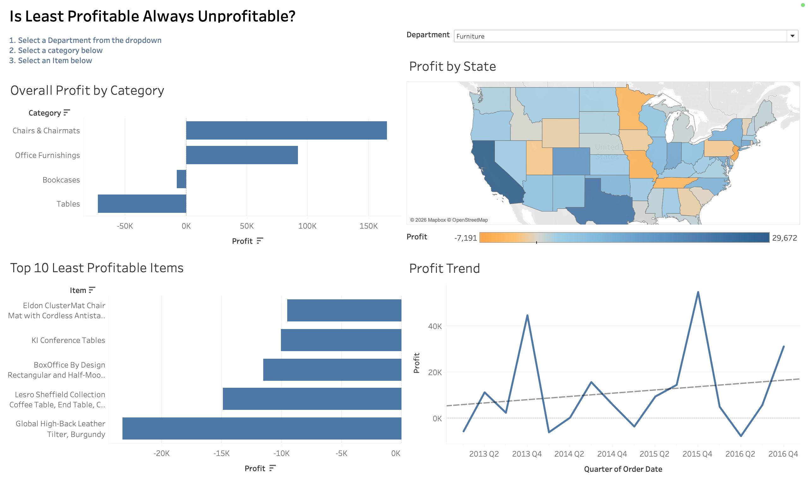

# 📊 Is Least Profitable Always Unprofitable?

### Product Profitability Analysis Dashboard (Tableau)

An interactive Tableau dashboard that analyzes product profitability across categories, geographic regions, and time. The goal is to identify loss-generating products, understand where and why losses occur, and determine whether unprofitable items are isolated cases or part of broader structural issues.

---

## ❗ Problem Statement

Most businesses focus heavily on revenue-generating products, while underperforming or loss-making products often go unnoticed.

This project investigates:

- Which products are responsible for the greatest losses?
- Are losses concentrated in specific categories or spread across the business?
- Do unprofitable products belong to otherwise profitable categories?
- Are losses driven by geography, time, or product structure?

---

## 🎯 Business Objective

The key objective of this analysis is to understand:

> **Whether the least profitable products are truly “bad products” or symptoms of deeper category-level or structural issues.**

This helps businesses make better decisions around pricing, discount strategy, product design, and category management.

---

## 📷 Dashboard Preview



---

## 📊 Dashboard Overview

This interactive Tableau dashboard allows users to explore profitability through multiple layers:

### 🧩 1. Category Profitability Analysis
Breaks down total profit by category to identify which business segments generate profit versus losses.

### 🗺 2. Geographic Profit Distribution
A state-level map visualization highlighting regions with strong profitability versus consistent losses.

### 📉 3. Top 10 Least Profitable Products
Ranks products generating the highest financial losses to help prioritize improvement opportunities.

### 📈 4. Profit Trend Analysis
Shows quarterly profit trends with a trend line to identify seasonality, volatility, and long-term performance direction.

### 🔍 5. Drill-Down Filtering
Interactive filters allow exploration from:
**Department → Category → Product**

---

## 💡 Key Insights

The analysis reveals several important business patterns:

- Certain products within the Furniture category (especially tables) are the **largest contributors to negative profit**.
- Despite containing loss-making items, categories such as Chairs & Chairmats remain **overall profitable**, showing that product-level losses do not always reflect category performance.
- Profitability varies significantly across states, indicating **geographic inconsistency in performance**.
- Profit trends fluctuate by quarter, suggesting potential influence from **seasonality or promotional cycles rather than stable growth patterns**.
- The least profitable products are not always isolated issues—they often reflect **systemic pricing or cost structure problems**.

---

## 📌 Business Takeaway

Instead of removing individual loss-making products, the analysis suggests a more strategic approach:

- Evaluate pricing and discount strategies at the **category level**
- Investigate cost structure behind high-loss product groups
- Address geographic performance inconsistencies
- Focus on structural improvements rather than isolated product elimination

---

## 🛠 Tools & Skills Used

### Tools
- Tableau Desktop
- Tableau Calculated Fields
- Interactive Dashboards
- Geographic Mapping
- Trend Line Analysis

### Skills
- Data Visualization
- Business Intelligence
- Profitability Analysis
- Drill-down Analysis
- Geographic Data Analysis
- Time Series Analysis
- Data Storytelling
- Dashboard Design

---

## 📂 Dataset

**Dataset Used:** Global Superstore Dataset

Includes:

- Orders
- Products
- Sales
- Profit
- Categories
- Departments
- States
- Order Dates

---

## 📁 Repository Contents

```
├── README.md
├── dashboard.png
├── WS6-Hoang Tram Anh Tran.twbx
└── LICENSE
```

---

## 📈 What This Project Demonstrates

This project demonstrates my ability to:

- Translate raw business data into actionable insights
- Design executive-level dashboards for decision-making
- Identify structural business problems using data
- Communicate insights clearly to non-technical stakeholders
- Apply analytical thinking to profitability and performance analysis

---

## 👤 Author

**Irene Tran**  
Data Analyst | Tableau | Excel | SQL | Python (Learning)

📍 Toronto, Canada  
🔗 LinkedIn: https://www.linkedin.com/in/irene-tran-76380714a/  
🔗 GitHub: https://github.com/Irenetran3011
